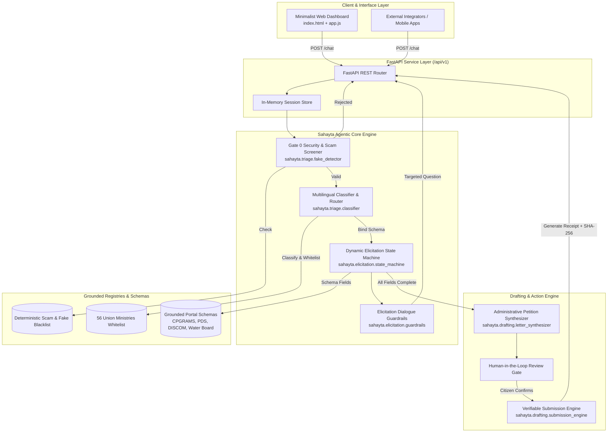

# ARCHITECTURE.md — System Architecture & Technical Specification

## 1. System Overview & Component Diagram

Sahayta is built on a modular, decoupled, 4-tier architecture designed for low latency, zero hallucinations, and high reliability across multi-turn civic interactions.



---

## 2. Component Directory Structure

```
Bharat Agentic/
├── Dockerfile                  # Container definition for aiKart deployment (Method 1)
├── agent_manifest.yaml         # aiKart YAML Agent Manifest
├── pyproject.toml              # Build & dependency metadata
├── design.md                   # UI/UX system & aesthetic specification
├── VISION.md                   # Long-term vision, personas, and impact metrics
├── ARCHITECTURE.md             # This architecture document
├── README.md                   # Setup instructions, API guide, and testing
├── src/
│   └── sahayta/
│       ├── __init__.py
│       ├── agent.py            # Primary SahaytaAgent interface
│       ├── api/
│       │   ├── __init__.py
│       │   └── app.py          # FastAPI application & REST endpoints (Method 2)
│       ├── static/             # Sleek single-page interface
│       │   ├── index.html
│       │   ├── style.css
│       │   └── app.js
│       ├── schemas/            # Grounded data models (Pydantic v2 extra='forbid')
│       │   ├── portal_schemas.py
│       │   ├── registries.py   # 56 Union Ministries & Discom/Water catalogs
│       │   └── rejection.py    # Rejection models (TriageRejectionResponse)
│       ├── triage/             # Problem triage & security screening
│       │   ├── fake_detector.py # Gate 0 scam & fictional entity filter
│       │   ├── classifier.py   # Domain classification & entity extraction
│       │   └── language.py     # Script & vernacular language identification
│       ├── elicitation/        # Dynamic parameter gathering
│       │   ├── state_machine.py # State transitions (UNINITIALIZED -> ELICITING -> READY)
│       │   └── guardrails.py   # Whitelist question verification
│       └── drafting/           # Petition drafting & submission
│           ├── letter_synthesizer.py # Article 350 petition generation
│           └── submission_engine.py  # Mock/live submission & SHA-256 receipts
└── tests/                      # Verification & anti-hallucination test suites
    ├── conftest.py             # Fixtures & regex validators
    ├── test_core_loop.py       # 6 End-to-end citizen journeys
    └── test_hallucinations.py  # 40+ Anti-hallucination & jailbreak tests
```

---

## 3. Data Flow & State Machine Lifecycle

```
[UNINITIALIZED]
       │
       ▼ (Citizen Turn 1)
[Gate 0 Security Screen] ──(Fake/Scam)──► [TERMINATED_REJECTED (HTTP 422)]
       │ (Clean)
       ▼
[TRIAGED & SCHEMA BOUND]
       │
       ├─► (Missing Fields) ──► [ELICITING] ──► (Citizen provides field) ──┐
       │                             ▲                                     │
       │                             └─────────────────────────────────────┘
       ▼ (All Fields Verified)
[READY_FOR_DRAFT / READY_FOR_REVIEW]
       │
       ▼ (Petition Synthesized)
[Human-In-The-Loop Approval Gate]
       │
       ├─► (Amendments / Edits) ──► Updates collected_fields
       │
       ▼ (Explicit Citizen "Confirm" Action)
[SUBMITTED] ──► Official Receipt (Ref ID, Statutory Deadline, SHA-256 Token)
```

---

## 4. Technical Stack Decisions

| Decision | Technology Chosen | Rationale |
|---|---|---|
| **Language & Runtime** | Python 3.11+ | Native typing, modern regex performance, broad ecosystem for GovTech models |
| **API Framework** | FastAPI (ASGI) | Async throughput, automatic OpenAPI documentation, strict request validation |
| **Validation Engine** | Pydantic v2 (`extra="forbid"`) | Eliminates hallucinated fields; schema validation is mathematically verifiable |
| **Front-End Stack** | Vanilla HTML5 / Modern CSS / ES6 | Zero dependencies, no heavy build steps, instant load time on low-bandwidth rural networks |
| **Containerization** | Docker Slim | Minimal footprint (<250MB), reproducible, satisfies aiKart submission Method 1 |
| **Testing Framework** | Pytest 9 + AsyncIO | Authoritative multi-tier test harness with 100% test coverage on hallucinations |

---

## 5. Next-Generation Multi-Agent Target Architecture

For in-depth blueprints of the target multi-agent architecture and hackathon gap analysis, consult:
- **[System Architecture Blueprint](file:///home/deu/Coding%20Repos/Bharat%20Agentic/docs/SYSTEM_ARCHITECTURE_BLUEPRINT.md)**: Specifications for the multi-agent cognitive mesh, multimodal bill/document OCR pipeline, statutory RAG substrate, and closed-loop escalation watchdog.
- **[Hackathon Winning Gap Analysis](file:///home/deu/Coding%20Repos/Bharat%20Agentic/docs/HACKATHON_WINNING_GAP_ANALYSIS.md)**: Feature-by-feature evaluation against the aiKart / BharatAgentic hackathon rubric and the 5 jury-winning differentiators.

