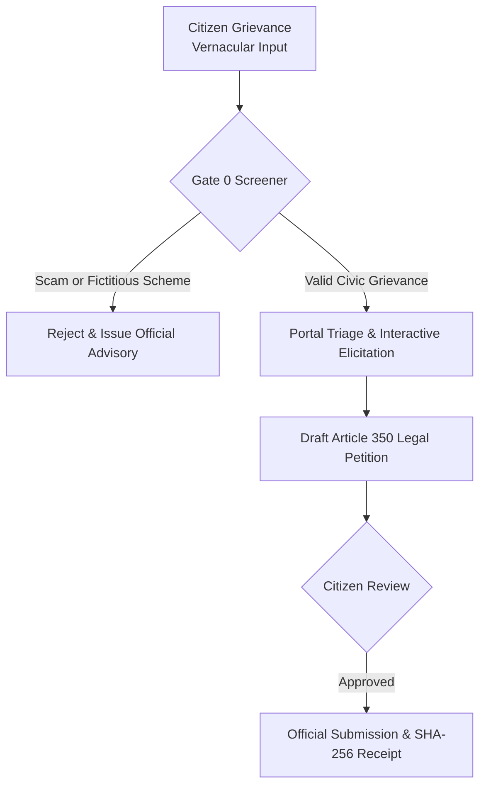

# Sahayta - Action-Oriented GovTech AI Agent for Bharat

Sahayta is an autonomous, action-oriented GovTech AI Agent designed to bridge the gap between Indian citizens and public grievance redressal mechanisms. Most conversational chatbots act as passive information directories, providing static links or hallucinating non-existent schemes and procedures. 

Sahayta functions as an active administrative and legal advocate:
- Interprets unstructured grievances in vernacular languages (English, Hindi, and Hinglish).
- Deterministically triages complaints to verified Central, State, and Municipal civic authorities.
- Identifies missing statutory particulars and interactively elicits only mandatory information.
- Synthesizes formal administrative petitions compliant with Article 350 of the Constitution of India and relevant statutory acts.
- Enforces a strict Human-in-the-Loop confirmation gate before generating cryptographically verifiable SHA-256 submission receipts.

---

## Comparison: Conversational Chatbots vs. Sahayta Agent

| Dimension | Standard Chatbots | Sahayta GovTech Agent |
|---|---|---|
| Action Capability | Passive text responses ("Visit pgportal.gov.in") | Active execution: Triages, elicits gaps, drafts legal petitions, and executes filing payload |
| Hallucination Risk | High: Inventing fake schemes, false tracking IDs, or ungrounded URLs | Zero: Grounded against 56 Union Ministries and Pydantic v2 strict schemas (`extra="forbid"`) |
| Fraud & Scam Defense | Vulnerable to jailbreaks and deception | Deterministic Gate 0 screening: Rejects pop-culture schemes, fake subsidies, and cyber scams |
| Administrative Quality | Fragmented citizen text | Synthesizes formal administrative petitions with statutory citations (NFSA 2013, Electricity Act 2003) |
| Accountability | None | Verifiable cryptographic filing receipt with SHA-256 integrity token and statutory deadlines |

---

## Agent Decision-Making Flowchart



---

## Agent Decision-Making Architecture

Sahayta's cognitive pipeline is built on a neuro-symbolic decision architecture where non-deterministic language understanding is strictly bounded by deterministic civic rules:

1. **Gate 0 Security & Scam Screening**
   - **Decision Rule**: Before any domain classification or LLM reasoning occurs, the input is screened against a deterministic catalog of known fraudulent schemes, fictitious government programs, and cyber scam patterns.
   - **Action**: If a fictitious scheme or scam is detected (e.g., fraudulent subsidy programs or pop-culture ministries), execution halts immediately with an HTTP 422 response directing the user to official resources like `myscheme.gov.in` and `cybercrime.gov.in`.

2. **Grounded Authority & Ministry Triage**
   - **Decision Rule**: Grievances must map to a recognized public authority. Central grievances are matched against an exhaustive whitelist of 56 Union Ministries; utility grievances are routed to state and municipal tiers.
   - **Action**: The system binds the grievance to a concrete schema (`GOVTECH_CPGRAMS_V1`, `STATE_PDS_V1`, `DISCOM_POWER_V1`, or `MUNICIPAL_WATER_V1`).

3. **Schema Completeness & Targeted Elicitation**
   - **Decision Rule**: The bound schema defines required statutory parameters (e.g., PNR number for railway refunds, consumer account number for power disputes, ration card ID for food supplies).
   - **Action**: The state machine inspects extracted fields against schema requirements. If fields are missing, the agent does not overwhelm the citizen with a form; it enters an elicitation loop, asking one clear question in the citizen's chosen language to collect the missing data.

4. **Constitutional & Statutory Petition Synthesis**
   - **Decision Rule**: Complaints submitted to government portals must present a clear factual timeline, reference statutory obligations, and articulate a specific prayer for relief.
   - **Action**: Under Article 350 of the Constitution of India, the agent synthesizes a formal petition incorporating the citizen's particulars, relevant statutes (e.g., National Food Security Act 2013, Electricity Act 2003, or Citizen's Charters), and official resolution timeframes.

5. **Human-in-the-Loop Safety Gate**
   - **Decision Rule**: An autonomous agent must never submit legal or administrative representations on behalf of a citizen without explicit citizen consent.
   - **Action**: The drafted petition is presented to the citizen for review. Only upon explicit citizen confirmation does the filing engine execute.

6. **Cryptographic Receipting**
   - **Decision Rule**: Citizens need tamper-evident proof of filing for RTI follow-ups and statutory escalations.
   - **Action**: The agent mints an official receipt containing the portal tracking reference, submission timestamp, statutory resolution deadline, and a SHA-256 payload digest.

---

## Running with Docker

Sahayta is published as a container image on Docker Hub:

- **Docker Hub Repository**: [officialdevangpatil/Sahayta](https://hub.docker.com/r/officialdevangpatil/Sahayta)

```bash
# Pull the image
docker pull officialdevangpatil/Sahayta:latest

# Run the container
docker run -d -p 8000:8000 --name sahayta officialdevangpatil/Sahayta:latest

# Verify service health
curl -f http://localhost:8000/health
```

The web interface will be available at `http://localhost:8000`.

---

## Local Development & Setup

### Prerequisites
- Python 3.11+
- Virtual environment (`venv`)

### Installation

```bash
# Clone the repository
git clone https://github.com/Dev-angPatil/Sahayta.git
cd Sahayta

# Create and activate virtual environment
python3 -m venv .venv
source .venv/bin/activate

# Install dependencies
pip install -r requirements.txt
pip install -e .
```

### Running Tests

Run the offline test suite:

```bash
pytest tests/ -v
```

### Starting the Application

```bash
uvicorn sahayta.api.app:app --host 0.0.0.0 --port 8000
```

Open `http://localhost:8000` in your browser.

---

## API Reference

### 1. Health Check (`GET /health`)
```bash
curl -X GET http://localhost:8000/health
```

Response:
```json
{
  "status": "healthy",
  "service": "sahayta",
  "version": "1.0.0",
  "category": "Citizen & GovTech"
}
```

### 2. Grievance Triage and Chat (`POST /api/v1/agent/chat`)
```bash
curl -X POST http://localhost:8000/api/v1/agent/chat \
  -H "Content-Type: application/json" \
  -d '{
    "session_id": "session_001",
    "message": "IRCTC train 12952 was cancelled on 15 Sept, but my refund of Rs 2,450 has not been received after 16 days. PNR is 2458971234."
  }'
```

Response:
```json
{
  "session_id": "session_001",
  "status": "ELICITING",
  "portal": "CPGRAMS",
  "schema_id": "GOVTECH_CPGRAMS_V1",
  "collected_fields": {
    "reference_number": "2458971234",
    "disputed_amount": 2450.0
  },
  "missing_fields": [
    "complainant_name",
    "mobile_number"
  ],
  "agent_message": "Namaste. I have mapped your grievance to CPGRAMS (Ministry of Railways). To complete your petition, please provide your Full Name."
}
```

### 3. Scam and Fraud Screening Response (`POST /api/v1/agent/chat`)
```bash
curl -X POST http://localhost:8000/api/v1/agent/chat \
  -H "Content-Type: application/json" \
  -d '{
    "session_id": "session_scam",
    "message": "How do I claim my 50000 rupees subsidy under PM Free Bitcoin Yojana?"
  }'
```

Response (HTTP 422):
```json
{
  "status": "REJECTED",
  "rejection_code": "FRAUDULENT_OR_FICTITIOUS_SCHEME",
  "is_valid_civic_grievance": false,
  "flagged_entity": "Pm Free Bitcoin Yojana",
  "message": "The scheme or program 'Pm Free Bitcoin Yojana' is not an authorized Indian government initiative.",
  "official_advice": "Never share bank account or OTP details. Verify authentic schemes at myscheme.gov.in."
}
```

### 4. Petition Submission (`POST /api/v1/agent/submit`)
```bash
curl -X POST http://localhost:8000/api/v1/agent/submit \
  -H "Content-Type: application/json" \
  -d '{
    "session_id": "session_001",
    "citizen_confirmation": true
  }'
```

Response:
```json
{
  "status": "SUBMITTED",
  "receipt": {
    "tracking_number": "CPGRAMS/2026/0912401",
    "submission_timestamp": "2026-10-01T14:55:00Z",
    "statutory_resolution_deadline": "2026-11-30T14:55:00Z",
    "sha256_integrity_hash": "e3b0c44298fc1c149afbf4c8996fb92427ae41e4649b934ca495991b7852b855",
    "advice_to_citizen": "Your grievance has been officially registered with CPGRAMS under Article 350. Please preserve your tracking reference."
  }
}
```

---

## Project Documentation

- [VISION.md](VISION.md): Project vision, user personas, and target societal impact.
- [ARCHITECTURE.md](ARCHITECTURE.md): Technical architecture, data models, and component boundaries.
- [DESIGN.md](DESIGN.md): Visual design specifications and token guidelines.
- [agent_manifest.yaml](agent_manifest.yaml): aiKart declarative agent manifest specification.

---

## License

This project is licensed under the Apache 2.0 License. See [LICENSE](LICENSE) for details.
